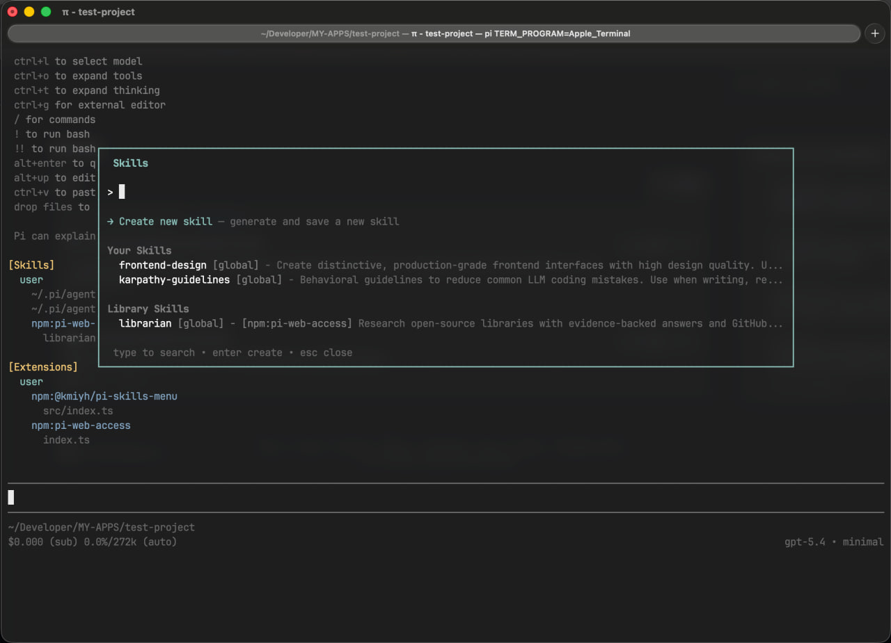
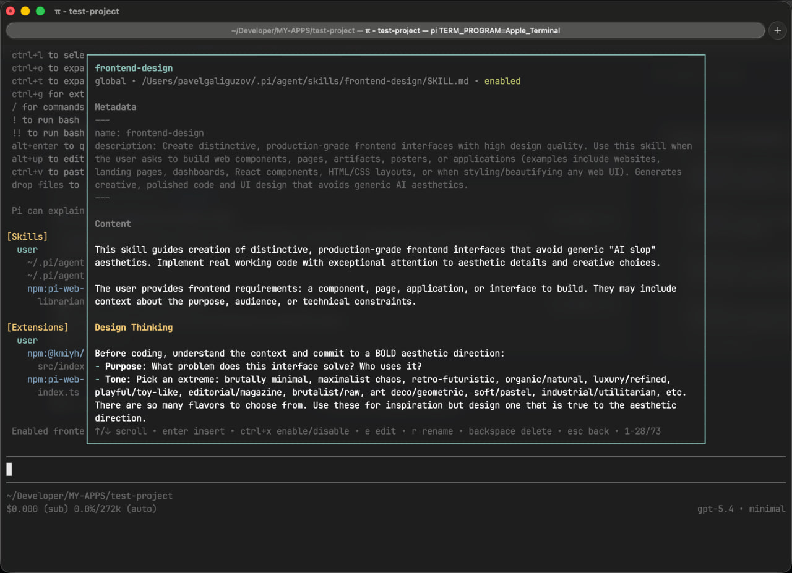
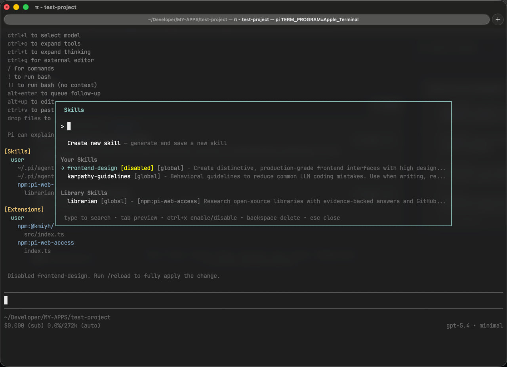
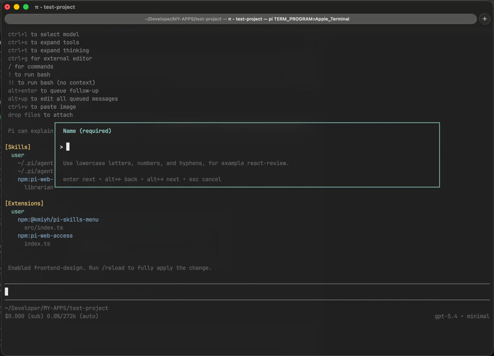
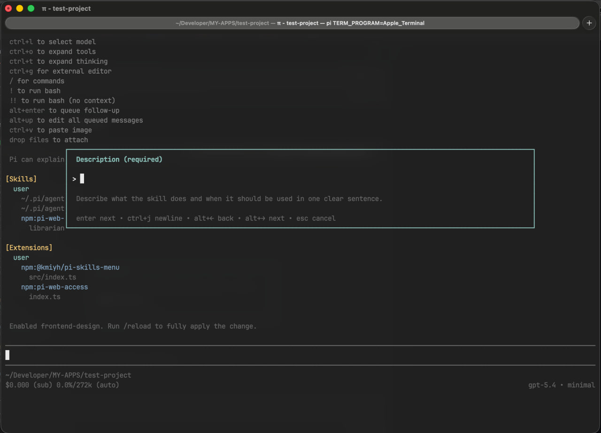
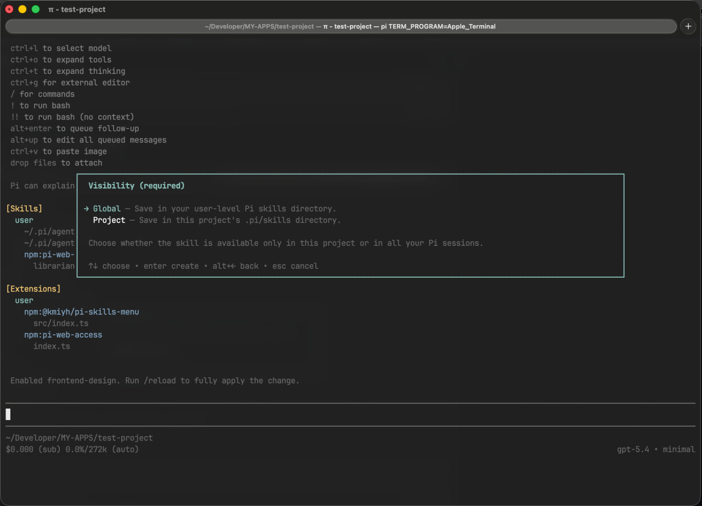
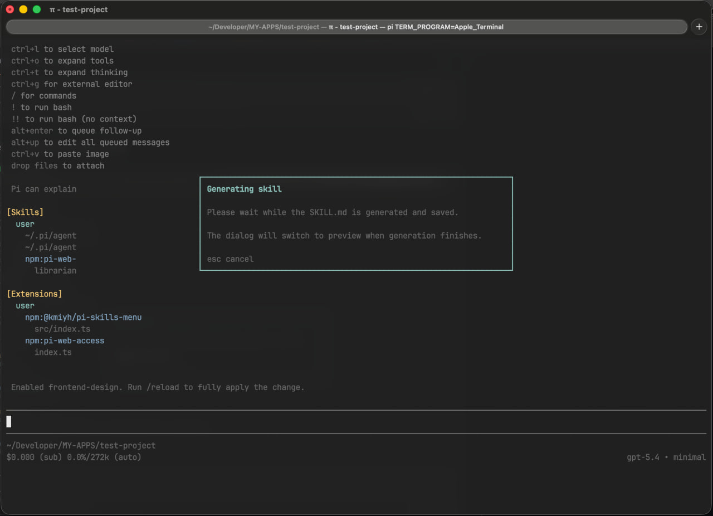
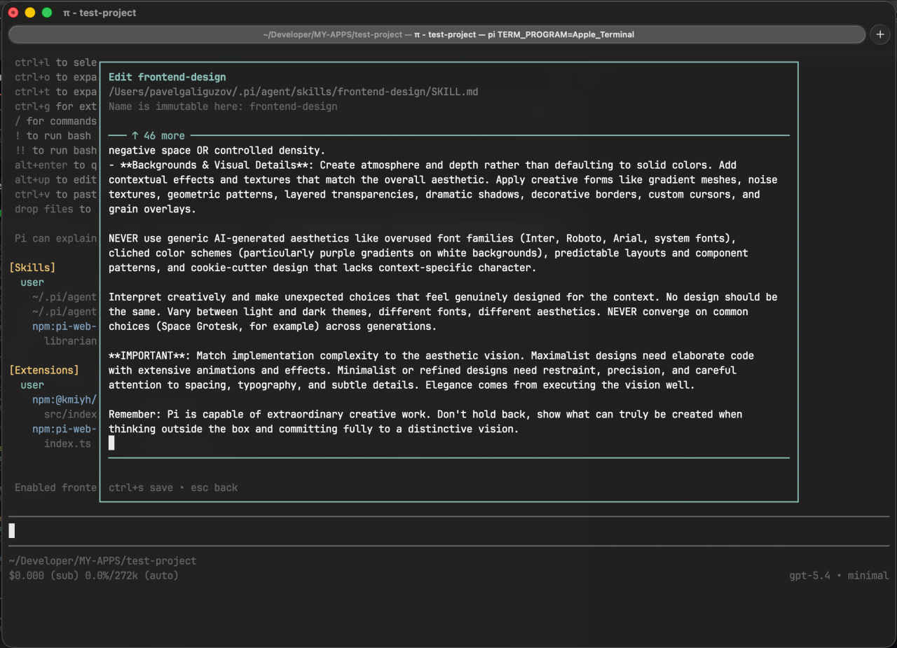
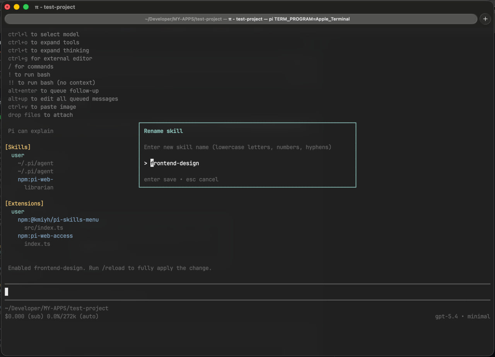
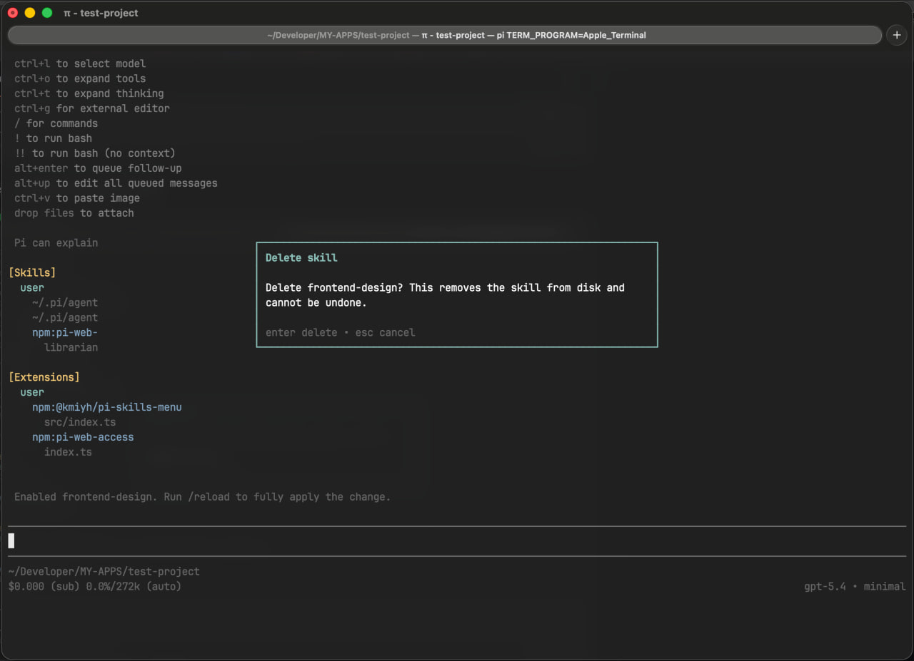

# @kmiyh/pi-skills-menu

`@kmiyh/pi-skills-menu` is a Pi extension that moves skill browsing and selection into a dedicated `/skills` menu.

Instead of filling Pi's main menu with many `/skill:<name>` entries, it gives you one focused place to search, preview, insert, create, edit, rename, delete, and enable or disable skills.

## Why use it

- keeps the main menu cleaner when many skills are installed
- puts project, global, and package-provided skills in one searchable list
- makes skill selection faster in interactive sessions
- lets you manage your own skills without leaving the TUI

## Installation

```bash
pi install npm:@kmiyh/pi-skills-menu
```

## What changes after installation

When the extension is installed, it automatically writes this to `settings.json`:

```json
{
  "enableSkillCommands": false
}
```

That disables the default `/skill:<name>` command registration in the main menu and replaces it with a single `/skills` entry.

When you insert a skill from the menu, the extension adds a marker like this to the editor:

```text
[skill] my-skill
```

Before the message is sent, Pi expands that marker into the actual skill content.

## What the `/skills` menu shows

The menu includes all available installed skills:

- project skills
- global skills
- skills provided by installed packages/libraries

The list is grouped into:

- **Your Skills** — your own project and global skills
- **Library Skills** — skills coming from installed packages



## What you can do in `/skills`

| Action | Shortcut | Notes |
| --- | --- | --- |
| Filter skills by name | type | Search works directly in the list |
| Open preview | `Tab` | Shows full metadata and content |
| Insert selected skill | `Enter` | Works only for enabled skills |
| Enable or disable a skill | `Ctrl+X` | Works for your skills and library skills |
| Create a new skill | `Enter` on **Create new skill** | Opens the creation flow |
| Delete your own skill | `Backspace` | Available only for project/global skills you own |

### Preview a skill

Press `Tab` on a selected skill to open preview mode.

The preview shows:

- the skill name and scope
- its source path or package
- whether it is enabled or disabled
- the full frontmatter
- the full skill content with scrolling support



### Insert a skill into the editor

Press `Enter` on an enabled skill to insert it into the editor.

This is useful when you want to explicitly attach one or more skills to the message you are writing, without manually copying skill content.

### Enable or disable a skill

Press `Ctrl+X` to toggle the selected skill.

Disabled skills stay visible in the list and are marked with `[disabled]`, so you can still find them and re-enable them later.

This also works for skills that come from installed packages.



## Creating a new skill

The first row in the menu is **Create new skill**.

Creation is split into three short steps:

1. **Name** — the skill folder/name slug
2. **Description** — one clear sentence describing what the skill does and when Pi should use it
3. **Visibility** — whether the skill should be saved globally or only for the current project

### 1. Name



### 2. Description



### 3. Visibility



After that, the extension generates `SKILL.md` for you.

Generation uses:

- the model currently selected in the TUI
- the current thinking level selected in the TUI

So the draft follows the model configuration already active in your Pi session.



## Editing, renaming, and deleting your own skills

Your own project and global skills can be managed directly from preview mode.

Library skills can be previewed, inserted, and enabled/disabled, but they cannot be edited, renamed, or deleted from this menu.

### Edit skill content

In preview mode, press `e` to edit the skill content and metadata body.

Use `Ctrl+S` to save.



### Rename a skill

In preview mode, press `r` to rename the skill.

This updates both the directory name and the `name` field in frontmatter.



### Delete a skill

In browse mode or preview mode, press `Backspace` to delete your own skill.

A confirmation dialog is shown before removal.



## Where new skills are saved

New skills are stored in Pi's standard skill directories depending on the selected visibility.

| Visibility | Path |
| --- | --- |
| Project | `.pi/skills/<skill-name>/SKILL.md` |
| Global | `~/.pi/agent/skills/<skill-name>/SKILL.md` |

Example project skill:

```text
.pi/skills/react-review/SKILL.md
```

## Local development

Install dependencies:

```bash
npm install
```

Run typecheck:

```bash
npm run typecheck
```

Run the extension directly from a local checkout:

```bash
pi -e ./src/index.ts
```

## Contributing

Contributions are welcome, especially around:

- menu UX and navigation
- skill search and filtering
- preview and editing flows
- skill generation quality
- Pi package compatibility

Typical workflow:

1. fork the repository
2. create a branch
3. make your changes
4. verify with:

```bash
npm install
npm run typecheck
```

5. test locally:

```bash
pi -e ./src/index.ts
```

6. open a pull request

## License

MIT
