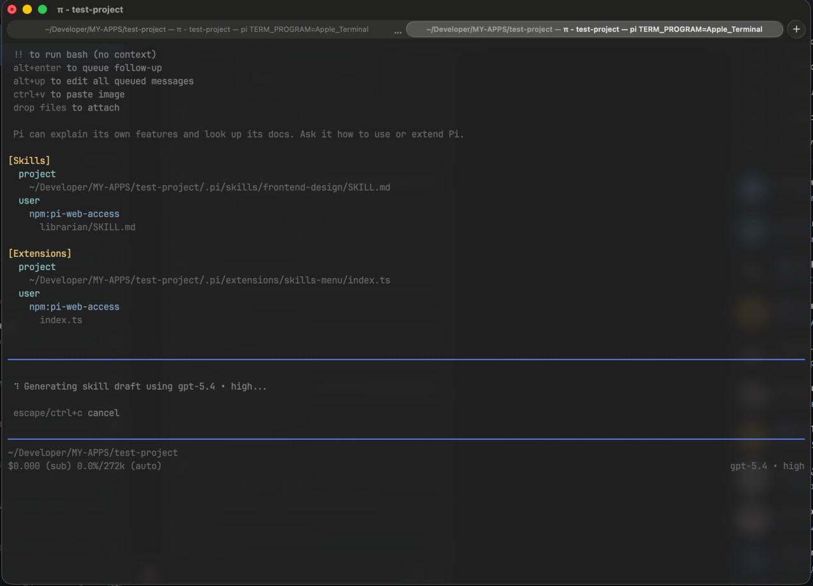

# @kmiyh/pi-skills-menu

`@kmiyh/pi-skills-menu` is a Pi Agent extension that moves all skills out of Pi's main menu into a separate menu opened with:

```bash
/skills
```

The idea behind the extension is simple: **keep the main menu from getting cluttered** and make it at least a bit easier to navigate when many skills are installed.

When the extension is installed, it automatically writes the following to `settings.json`:

```json
{
  "enableSkillCommands": false
}
```

This disables the default `/skill:<name>` command registration in the main menu and moves skill usage into one dedicated menu.

## Installation

It can be installed with:

```bash
pi install npm:@kmiyh/pi-skills-menu
```

## What the `/skills` menu contains

The menu shows **all installed available skills**:

- global skills
- project skills
- skills coming from other installed libraries/packages

The list is split into two sections:

- **Your Skills** — the user's own skills
- **Library Skills** — skills coming from other installed libraries


## What the menu can do

### Search

The menu includes a search field for filtering skills by name.

### Skill preview

Press:

- `Tab` — open the selected skill in preview mode


### Insert a skill into the editor

Press:

- `Enter` — select a skill and insert it into the editor

After that, the skill is inserted into the editor so it will be used by Pi when the message is sent.

### Create a new skill

The list also contains a dedicated entry for creating a new skill.

Skill creation is done in three steps:

1. **skill name**


2. **skill description**


3. **skill visibility**
   - **Global** — save the skill in your user-level Pi skills directory
   - **Project** — save the skill in the current project's `.pi/skills` directory

After that, the extension generates a `SKILL.md`.

Generation uses:

- the **currently selected model in the TUI**
- the **currently selected thinking level** in the TUI

So skill generation always follows the exact model configuration already active in the current Pi session.



## Skill preview

The preview opened with `Tab` contains:

- the full skill text
- scrolling support for reading the content

From preview mode, you can also use quick actions:

- `r` — edit the skill name


- `e` — edit the skill content itself


## Where new skills are saved

New skills are saved into Pi's standard skill directories depending on the selected scope.

### Project scope

If project scope is selected, the skill is saved here:

```text
.pi/skills/<skill-name>/SKILL.md
```

Example:

```text
.pi/skills/react-review/SKILL.md
```

### Global scope

If global scope is selected, the skill is saved here:

```text
~/.pi/agent/skills/<skill-name>/SKILL.md
```

## Local development

Install dependencies:

```bash
npm install
```

Run typecheck:

```bash
npm run typecheck
```

Run the extension directly from a local checkout:

```bash
pi -e ./src/index.ts
```

## How to help improve the extension

If you want to help improve the extension, you can:

- report bugs and UX issues
- suggest improvements to the `/skills` menu
- improve skill generation quality
- improve search and list navigation
- improve editing and preview flows
- suggest improvements to project structure and Pi package support
- etc

A typical contribution workflow:

1. fork the repository
2. create a separate branch
3. make your changes
4. verify everything with:

```bash
npm install
npm run typecheck
```

5. test locally

```bash
pi -e ./src/index.ts
```

6. open a pull request

## License

MIT
